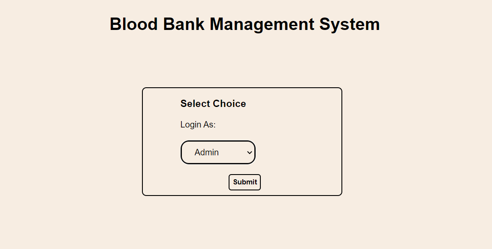
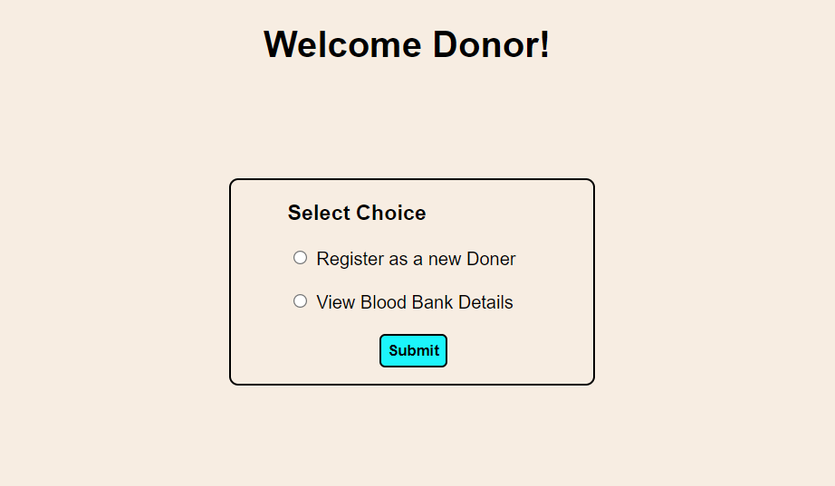
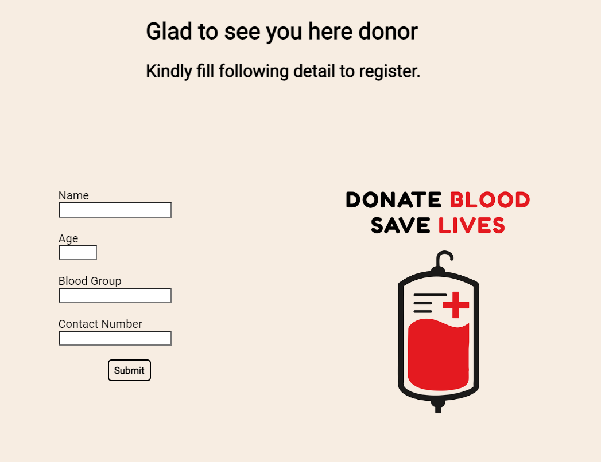
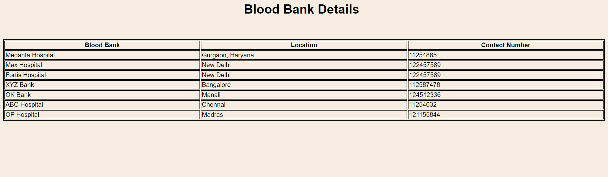
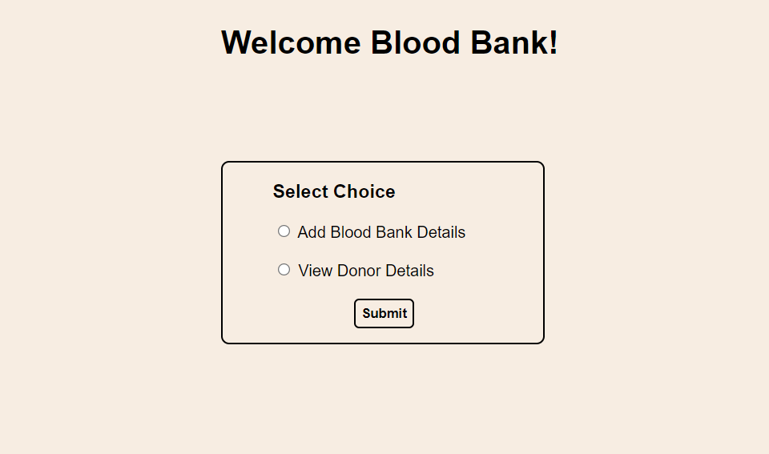
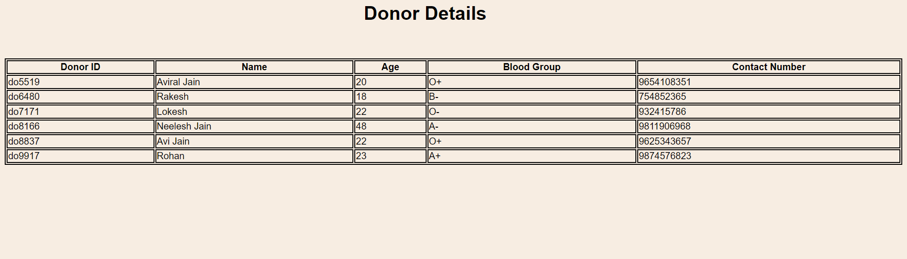
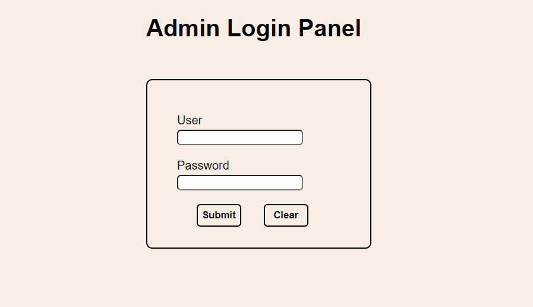
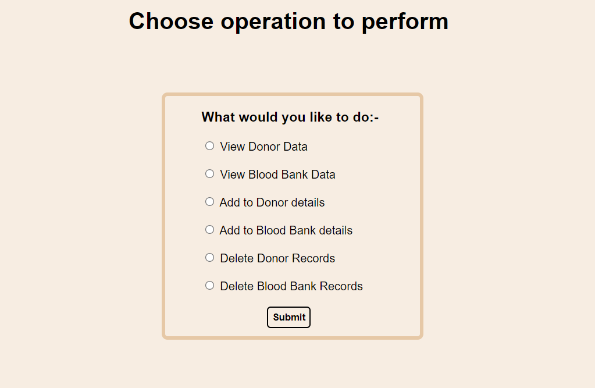

# Blood-Bank-Management-System
This a Maven Based Java Web Project. The Main Objective of this System is to design a Web based Application to maintain 
considerable information  of  the Patients,  Donors, &  Report  details  for  any  blood-related 
organization.  The application also keeps a record of the donor’s health record for future 
reference. Blood seekers can request for blood to the administrator.

Modules: 
1. Admin Module – View Donors list/Add/Delete Donors 
2. Donor Module – Registration/View Blood Bank Details 
3. Blood Bank Module – Add/View Details

## Technologies Used
1. Java
2. Apache Maven
3. Tomcat Server
4. MySQL Database
5. JSP
6. CSS

## IDE Used
* Eclipse Enterprise Edition

## Preview

 
 ### Donor Module
 
 
 
 
 ### Blood Bank Module
 
 
 
 ### Admin Module
 
 
